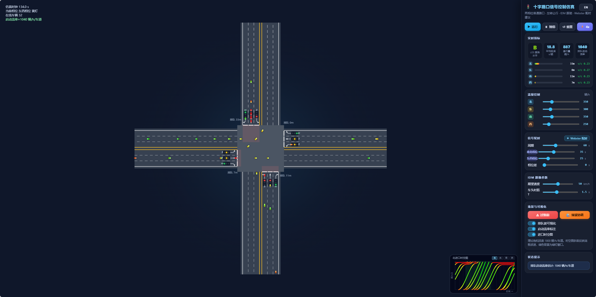

# 十字路口信号控制仿真

[English](./README.en.md)

一个可直接在浏览器打开的单点交叉口信号控制仿真页面，用于展示不同流量与配时条件下的路口运行状态。页面提供实时指标、场景切换和进口时空图，适合用于演示和观察单路口信号控制效果。

## 功能

- 两相位对向同放，左转让行，右转常绿
- 四个进口流量独立可调，并按左直右比例分配到车道
- 支持周期、南北相位绿灯、东西相位绿灯和相位差调整
- 支持 `Webster 配时` 一键生成建议周期和绿灯分配
- 内置 `过饱和` 和 `绿波协调` 场景
- 实时显示 LOS、平均延误、通行量和排队启动流率
- 进口时空图支持北、东、南、西方向切换
- 中英文界面切换时，侧栏、告警和画布标注同步更新

## 模型说明

- 路口范围：单个孤立四叉交叉口
- 车道设置：每个进口 1 条左转、1 条直行、1 条右转
- 到达过程：按进口流量和车道份额拆分的泊松到达
- 跟驰逻辑：IDM
- 信号逻辑：两相位对向同放，左转让行，右转常绿
- 启动流率：根据排队放行头时距估计，单位为 `辆/h/车道`
- 绿波场景：单点相位差示意，不包含走廊级协调控制

## 预览



## 演示视频

`media/demo.mp4`

## 快速开始

直接在浏览器打开 `index.html` 即可，无需安装依赖。

如需复现同一组运行结果，可在 URL 后加固定随机种子：

```text
index.html?seed=20260324
```

## 使用说明

### 画布区域

画布区域展示车辆运行、停车线、信号灯头、排队覆盖、状态提示条以及进口时空图。

### 控制面板

- `运行` / `暂停` / `重置`：控制仿真状态
- 流量控制：调整四个进口需求
- 信号配时：调整周期、两相位绿灯和相位差
- `Webster 配时`：按当前需求自动生成建议配时
- `过饱和`：切换到高需求拥堵场景
- `绿波协调`：切换到单点相位差演示场景
- 可视化开关：显示或隐藏排队波、启动流率标注和进口时空图

### 实时指标

- LOS 服务水平：根据平均延误映射得到等级
- 平均延误：单位为 `s/辆`
- 通行量：折算为 `辆/h`
- 排队启动流率：根据排队放行头时距估计

## 浏览器支持

- 推荐浏览器：Chrome / Edge 最新版
- Safari / Firefox 一般应可运行，正式发布前建议手测一次
- 如需录制稳定的演示素材，建议使用固定随机种子

## 目录结构

- `media/cover.png`：README 使用的主界面封面图。
- `media/demo.mp4`：项目演示视频，展示场景切换和交互流程。
- `index.html`：页面入口，定义画布、控制面板和各类 UI 节点。
- `LICENSE`：项目开源协议。
- `README.md`：中文使用说明。
- `README.en.md`：英文使用说明。
- `src/intersection.analytics.js`：LOS、延误、启动流率、Webster 相关计算逻辑。
- `src/intersection.config.js`：仿真默认参数和几何常量配置。
- `src/intersection.css`：页面布局、控件样式和响应式样式。
- `src/intersection.geometry.js`：路口几何、车道边界、停车线和信号灯头位置计算。
- `src/intersection.i18n.js`：中英文文案和界面语言切换逻辑。
- `src/intersection.models.js`：车辆、信号机、排队检测等核心数据模型。
- `src/intersection.render.js`：画布绘制逻辑，包括车辆、排队覆盖、标注和时空图。
- `src/intersection.simulation.js`：车辆生成、跟驰、放行和仿真时间推进逻辑。
- `src/intersection.ui.js`：控件绑定、场景切换、指标刷新和 UI 状态同步。

## 开源协议

本项目采用 [MIT License](./LICENSE)。
